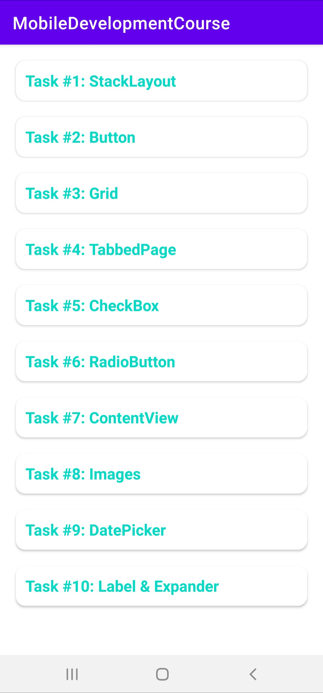

# Разработка мобильных приложений

## Задания

* Задание 1. Работа с макетом StackLayout - **completed** [Скриншот](img/Task1StackLayout.jpg) [Разметка](app/src/main/res/layout/task_1_sl_activity.xml) [Код](app/src/main/java/com/chebnevdev/mobiledevelopmentcourse/task1/Task1SLActivity.kt)
* Задание 2. Работа с кнопкой Button - **completed** [Скриншот](img/Task2Button.jpg) [Разметка](app/src/main/res/layout/task_2_button_activity.xml) [Код](app/src/main/java/com/chebnevdev/mobiledevelopmentcourse/task2/Task2ButtonActivity.kt)
* Задание 3. Работа с макетом Grid - **completed** [Скриншот-1](img/Task3Grid1Screen.jpg) [Разметка-1](app/src/main/res/layout/task_3_1_layout.xml) [Скриншот-2](img/Task3Grid2Screen.jpg) [Разметка-2](app/src/main/res/layout/task_3_2_layout.xml) [Скриншот-3](img/Task3Grid3Screen.jpg) [Разметка-3](app/src/main/res/layout/task_3_3_layout.xml) [Код](app/src/main/java/com/chebnevdev/mobiledevelopmentcourse/task3/Task3GridActivity.kt)
* Задание 4.1. Работа со страницей MasterDetailPage - **completed** [Скриншот](img/Task4Page1.jpg) [Код](Tabbed/Tabbed/Tabbed/MasterDetail)
* Задание 4.2. Работа со страницей TabbedPage - **completed** [Скриншот-1](img/Task4Page2Screen1.jpg) [Скриншот-2](img/Task4Page2Screen2.jpg) [Скриншот-3](img/Task4Page2Screen3.jpg) [Код и разметка](Tabbed/Tabbed/Tabbed/Tabbed)
* Задание 4.3. Работа со страницей CarouselPage - **completed** [Скриншот-1](img/Task4Page3Screen1.jpg) [Скриншот-2](img/Task4Page3Screen2.jpg) [Код и разметка](Tabbed/Tabbed/Tabbed/Carousel)
* Задание 4.4. Работа со страницей и темами - **completed** [Скриншот-1](img/Task4Page4Screen1.jpg) [Скриншот-2](img/Task4Page4Screen2.jpg) [Код и разметка](Tabbed/Tabbed/Tabbed/Theme)
* Задание 5. Работа с элементами управления CheckBox - **completed** [Скриншот](img/Task5CheckBox.jpg) [Код и разметка](Tabbed/Tabbed/Tabbed/CheckBox)
* Задание 6.1. Работа с радиокнопками - **completed** [Скриншот](img/Task6Page1.jpg) [Код и разметка](Tabbed/Tabbed/Tabbed/RadioButton)
* Задание 6.2. Работа с элементом управления Stepper - **completed** [Скриншот](img/Task6Page2.jpg) [Код и разметка](Tabbed/Tabbed/Tabbed/Stepper)
* Задание 7. Использование макета ContentView - *to do*
* Задание 8. Работа с изображениями - *to do*
* Задание 9. Работа с элементом управления DatePicker - *to do*
* Задание 10. Работа с элементами управления Label и Expander - *to do*

## Навигация

В [главном пакете](app/src/main/java/com/chebnevdev/mobiledevelopmentcourse) расположены классы основного экрана - на нём отображается список заданий:

Классы заданий расположены в подпакетах главного пакета, например, [task1](app/src/main/java/com/chebnevdev/mobiledevelopmentcourse/task1) для первого задания.
Ресурсы разметки расположены в папке [layout](app/src/main/res/layout) и называются соответственно, например, [task_1_sl_layout.xml](app/src/main/res/layout/task_1_sl_activity.xml) для разметки страницы первого задания.
